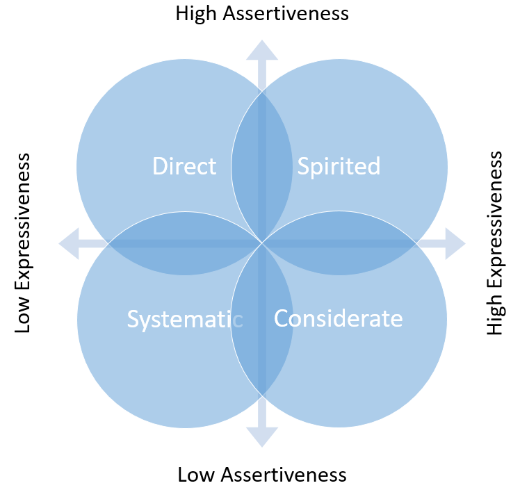

Cần sử dụng những cách giao tiếp khác nhau với những đối tượng khác nhau. Chọn kiểu giao tiếp phù hợp sẽ giúp mình dễ dàng giao tiếp và trao đổi thông tin hiệu quả hơn trong công việc lẫn cuộc sống! Giao tiếp **Quyết đoán** hay **Cảm xúc** và… trong trường hợp nào??

## Ma trận giao tiếp của tiến sĩ Eileen Russon

Tiến sĩ Eileen Russo đã đưa ra một biểu đồ mà cô đã thể hiện sự phân loại giao tiếp. Theo cô, giao tiếp sẽ xảy ra ở 2 chiều khác nhau giữa **sự biểu cảm** và **sự quyết đoán**! Biểu đồ dưới đây sẽ biểu thị trực quan cho sự phân tích của tiến sĩ Eileen Russo…

Mỗi góc phần tư trên biểu đồ đại diện cho mỗi phong cách giao tiếp khác nhau. Chúng ta có thể rơi vào bất cứ đâu trong các góc phần tư này khi giao tiếp! Vậy một cái nhìn tổng quan về 4 phong cách giao tiếp trong ma trận này sẽ có các tác động khác nhau như thế nào?

-   Phong cách **quyết đoán** nhiều hơn có xu hướng **nói** cho người khác biết **phải làm gì**.
-   Phong cách ít **quyết đoán** có xu hướng **hỏi** người khác **những gì nên làm?**.
-   Phong cách **biểu cảm** nhiều hơn có xu hướng thể hiện cảm xúc lên **khuôn mặt, lời nói và giọng điệu**.
-   Phong cách ít **biểu cảm** thường có xu hướng cố **che giấu** hoặc **không** thể hiện cảm xúc ra ngoài.

Dưới đây là công thức kết hợp 04 phong cách giao tiếp cơ bản dựa trên biểu đồ của tiến sĩ **Eileen Russo**.

-   Low Expressiveness + High Assertiveness = Direct
-   High Expressiveness + High Assertiveness = Spirited
-   Low Expressiveness + Low Assertiveness = Systematic
-   High Expressiveness + Low Assertiveness = Considerate

Cùng tìm hiểu thêm các nét đặc trưng của mỗi loại giao tiếp và cách sử dụng chúng để giao tiếp hiệu quả hơn!

## #1 Direct Style

Những người giao tiếp theo phong cách **giao tiếp trực tiếp** sẽ quyết đoán nhiều và ít biểu cảm. Họ thường **bảo** người khác **phải làm gì** thay vì nói với người khác họ đang nghỉ **những gì nên làm**. Phong cách giao tiếp này mang xu hướng khằng định **nhanh chóng** dù những người khác có thể không có góc nhìn giống mình.

Những người phong cách giao tiếp trực tiếp thường sẽ nói **nhanh và ngắn gọn** nhất để nhanh chóng sang vấn đề tiếp theo. Không phải là vì họ cố gắng lãng tránh vấn đề mà là họ muốn **tiết kiệm thời gian**. Họ thường không dừng lại để lắng nghe cho dù người khác có thể đóng góp một ý kiến có giá trị. Có thể bạn thấy họ đang hống hách và làm việc một cách cá nhân?

Nhưng ở góc nhìn khác của mình, họ chỉ đang cố gắng tập trung để đi đến kết quả nhanh nhất có thể thay vì cố biểu hiện cảm xúc của mình. Họ sẽ **nói lên suy nghĩ** của mình, cho dù nó có thể **gây khó chịu** cho người khác! Họ không nói quá nhiều về cuộc sống cá nhân! Thường rõ ràng giữa cuộc sống và công việc!

**Cách để giao tiếp hiệu quả khi bản thân bạn là người giao tiếp dạng Direct Style**

-   Hãy **tập lắng nghe** và đừng làm gián đoạn người khác khi họ đang nói hoặc có ý kiến.
-   Dành thời gian cho 'chatting' trước khi bắt đầu cuộc họp với mọi người.
-   Hãy **cho người khác cơ hội** nếu họ cần **biểu hiện cảm nghĩ** hoặc ý kiến về chủ để của bạn
-   Dành thời gian để **động não**, suy nghĩ sẽ có thể hữu ích chứ **không** quá "lãng phí thời gian"
-   Trước mỗi cuộc họp, cố gắng **truyền đạt kỳ vọng** của bạn về buổi họp đó (Kéo dài bao lâu, các chủ để chính cần nói, kết quả mong muốn...)
-   Dành thời gian để dành sự **đánh giá** của bạn cho những người muốn đóng góp.
-   Hạn chế dùng Email cho những vấn đề nhạy cảm hoặc phức tạp mà hãy gặp trực tiếp.
-   Dành thời giản để hỏi, phản hồi và đưa ra ý kiến

**Cách để giao tiếp hiệu quả với những người giao tiếp dạng Direct Style**

-   Hỏi xem họ có thời gian để nói chuyện hay không trước khi bạn nhảy vào nói 😭
-   Nói ngắn gọn, nhanh chóng và tránh lang mang, dài dòng
-   Hạn chế tán gẫu trên mạng với họ hoặc nói chuyện không liên quan đến chủ đề hiện tại
-   Cố gắng nắm bắt và hiểu nhanh những gì họ nói (trước khi họ trở nên nóng giận hoặc chán nản khi phải giải thích với bạn quá nhiều)
-   Nếu cần họ hãy liên lạc trực tiếp hoặc yêu cầu chính xác thời gian để họ gọi cho bạn
-   Chỉ hứa những gì bạn có thể làm hoặc hoàn toàn có thể cung cấp
-   Đừng cố hỏi các vấn đề riêng tư, cá nhân của họ
-   Đừng dùng lời mật ngọt và nói suôn khi chưa biết kết quả

### Tóm lược về Direct Style

Những người thuộc nhóm này thường "Go-Getters"! Họ sẽ làm việc chăm chỉ và nhanh chóng. Nhưng thường dễ cáu gắt nếu có quá nhiều câu hỏi!
Nên học và cải thiện kỹ năng lắng nghe để giao tiếp hiệu quả hơn. Tránh việc quá lạnh lùng và logic rồi trở nên độc tài và vô tâm.

## #2 Spirited Style

Những người có phong cách giao tiếp này thường quan tâm đến "Bức tranh tổng thể" - "Big Picture". Họ thường là người mơ mộng, truyền cảm hứng, inventors hoặc mang lại sự đổi mới cho Team. Sự giao tiếp của họ thường chứa đầy ý tưởng và có cường điều. Điều đó rất thu hút và dễ thuyết phục người nghe lúc đầu.

Những người này thường không giỏi trong việc thảo luận chi tiết vấn đề hoặc các bước chính xác của một quy trình. Họ thường đưa chuyện ngoài lề hoặc dẫn chứng khá nhiều trong cuộc đối thoại để minh hoạ cho ý tưởng của họ. Đôi khi từ những dẫn chứng đó họ **vô tình** đưa câu chuyện **sang hướng khác** so với mục tiêu ban đầu.

Giữ cho câu chuyện ngắn gọn và thẳng thắng là một thử thách đối với phong cách giao tiếp **Spirited**. Vì vậy việc **quản lý thời gian** và **tập trung vào vấn đề chính** sẽ là sự khó khăn với họ! Cho nên sẽ cần một người có thể hỗ trợ họ khi giao tiếp để đảm bảo câu chuyện đi đúng hướng và đưa họ quay trở lại đúng vấn đề khi cần thiết!

**Cách để giao tiếp hiệu quả khi bản thân bạn là người giao tiếp dạng Spirited Style**

-   Trước khi bạn **muốn chia sẻ ý tưởng** nào đó! Hãy **cân nhắc** xem bạn có gợi ý hoặc kế hoạch có thể hiện thực hoá ý tưởng hay không?
-   **Tôn trọng thời gian** của người khác khi tham gia họp hoặc giao tiếp và **tránh** nói lang mang, dài dòng...
-   **Hãy chắc chắn** bạn cho phép người khác cùng tham gia đóng góp ý kiến và ý tưởng của họ khi trò truyện - và bạn **cần lắng nghe**
-   Hãy chắc chắn **yêu cầu** của bạn đưa ra phải **rõ ràng**, và truyền đạt lý do tạo điều kiện cho người khác đặt câu hỏi
-   Hãy thể hiện sự **đánh giá cao** của bạn đối với người khác và **tiếp nhận** nội dung của họ

**Cách để giao tiếp hiệu quả với những người giao tiếp dạng Spirited Style**

-   Lên kế hoạch **giới hạn thời gian** thảo luận cho từng chủ đề
-   Thỉnh thoảng **nên khen ngợi** và tạo đồng thuận với họ và ý tưởng của họ
-   Học cách khéo léo, nhẹ nhàng **chuyển hướng câu chuyện** trở lại chủ đề chính khi nó bị lệch đi
-   Những lúc họ trình bày ý tưởng, hãy cân nhắc rằng **họ có thể nói phóng đại** vì đó chỉ là ý tưởng được họ vẽ ra
-   Hãy thử yêu cầu họ **break down** ý tưởng lớn của họ thành **các kết quả cần đạt** và **các bước thực hiện**.
-   **Xác nhận lại** với họ những gì họ nói sẽ đồng ý làm
-   **Sử dụng danh sách** todo hoặc note để nhắn hoặc truyền đạt những gì cần làm với họ và ngược lại

### Tóm lược về Spirited Style

Những người thuộc nhóm giao tiếp này thích làm sáng tỏ hoặc đưa ra ý tưởng, brainstorm (động não) và thường nói về Big-Picture (những bức tranh lớn).
Miễn là họ có thể **nói nhiều hơn**! Nhưng họ sẽ rất khó khăn để trình bày chi tiết ý tưởng hoặc các bước thực hiện ý tưởng đó. Hoặc thường khó tập trung vào một chủ đề chính nhất định...

## #3 Systematic Style

Giao tiếp có hệ thống là những người thường tập trung vào **sự thật và vấn đề chi tiết** nhiều hơn là các **ý kiến và khả năng**. Họ thường mong chờ được sử dụng và đánh giá thật cho một sản phẩm hoặc kết quả. Họ sẽ đánh giá và phân tích sự thật, sự việc hiện tại chứ không phải là những ý tưởng lớn "Big Picture" chưa được chứng minh và chưa thực hiện.

Họ có thể phản hồi chậm trong cuộc giao tiếp với bạn. Là vì họ sẽ phân tích tình huống và sự logic trước khi phản hồi. **Charts, Graphs hoặc xu thế thị trường** là những thông tin hữu ích để giao tiếp với những người thuộc **Systematic Style**. Ngoài ra nhóm người này thường không thích bày tỏ cảm xúc bản thân ra bên ngoài.

Họ chấm dứt cuộc giao tiếp khi phải đối mặt với các tình huống xử lý bằng tình cảm hoặc phải đối đầu. Nếu bạn là người giao nhiệm vụ, lên kế hoạch hoặc đưa chỉ dẫn cho họ. Bạn nên chuẩn bị cẩn thận, đầy đủ và chính xác thông tin trước khi chuyển giao cho họ! Bạn càng cung cấp nhiều thông tin có liên quan để giải quyết vấn đề cho họ - Họ sẽ càng hạnh phúc!

**Cách để giao tiếp hiệu quả khi bản thân bạn là người giao tiếp dạng Systematic Style**

-   Nên biết rằng không phải tất cả mọi người đều có cùng luồng suy nghỉ giống mình - **Phải thông cảm**
-   Học cách **đặt câu hỏi chất lượng hơn**, nó sẽ giúp bạn **thu thập được nhiều thông tin** hữu ích hơn
-   Đặt câu hỏi cho người khác về họ và thỉnh thoảng nên nói về cảm xúc để **xây dựng quan hệ**
-   Hãy đảm bảo rằng bạn **hiểu phạm rõ vi của dự án,** để không tốn công thu thập những **thông tin không cần thiết** cho dự án
-   Nếu **cần thêm thời gian** để phân tích cho một thông tin nào đó? Hãy thử **giải thích sự quan trọng và lợi ích**của thông tin đó.

**Cách để giao tiếp hiệu quả với những người giao tiếp dạng Systematic Style**

-   **Tập trung** vào sự thật và chi tiết của tình huống hiện tại thay vì ý kiến cá nhân của bản thân.
-   **Nói rõ ràng** thông tin và cụ thể thay vì nói khái quát
-   Đúng giờ, giao tiếp đúng chủ đề, cung cấp đủ thông tin cần thiết cho họ
-   Đưa ra **lý do hợp lý** cho hành động của bạn (tại sao bạn làm vậy, tại sao cần làm vậy) và những gì bạn muốn **yêu cầu họ làm**.
-   **Cho họ thời gian** để nghiên cứu và phân tích trước khi đưa ra quyết định (make-decision)
-   **Tránh hỏi**các chủ đề cá nhân, trừ khi họ chủ động

### Tóm lược về Systematic Style

Những người thuộc nhóm giao tiếp này sẽ tập trung vào sự thật và thông tin cụ thể, chi tiết. Giao tiếp với vài dẫn chứng, bằng chứng thuyết phục hoặc cung cấp thêm thông tin cần thiết sẽ hiệu quả hơn khi giao tiếp với họ. Họ không thoải mái về mặt bày tỏ cảm xúc và đối đầu (đối chất với ai đó).

## #4 Considerate Style

Nhóm này thuộc kiểu người giao tiếp thận trọng (uốn lưỡi 7 lần trước khi nói). Nói cách khác họ rất quan tâm đến cảm xúc của người khác khi giao tiếp! Họ luôn muốn làm hài lòng người khác và được đồng đẳng trong nhóm làm việc chung. Họ thích làm việc với người khác, giúp đỡ và **kết nối** những người khác ở mức độ cá nhân.

Nếu nhóm có sự bất đồng hoặc xung đột thì họ sẽ là người đứng lên xoa dịu tình hình và giải quyết ổn thoả vấn đề nội bộ. Họ muốn mỗi người có cơ hội nói lên suy nghỉ để họ thấu hiểu và cùng đóng góp lẫn nhau. Họ là những cố vấn tài ba, thích giúp đỡ người khác để cùng thành công! Họ ủng hộ việc hợp tác và giao tiếp nhóm. Nhưng đôi khi họ cũng không muốn nói lên suy nghỉ của bản thân vì sợ tổn thương hoặc gây xung đột với người khác.

Nhược điểm của họ là sợ làm tổn thương người khác nên sợ và không dám nói lên quan điểm trái ngược. Ngay cả khi là quan điểm của họ đúng, vì họ thích giữ mối quan hệ tốt và được tất cả mọi người yêu quý!

**Cách để giao tiếp hiệu quả khi bản thân bạn là người giao tiếp dạng Considerate Style**

-   Nên biết rằng suy nghỉ của người khác về một chủ đề nào đó không ảnh hưởng đến suy nghỉ của họ về bạn.
-   Không phải ai cũng thoải mái chia sẻ chuyện cá nhân với đồng nghiệp, Hãy chắc chắn người khác sẵn sàng chia sẻ chuyện cá nhân trước khi hỏi!
-   Học cách tôn trọng ý kiến của bản thân (dám nói ra ý kiến bản thân cũng là tự tôn trọng mình) như cách mà bạn coi trọng ý kiến của người khác.
-   Bạn không thể làm hài lòng tất cả mọi người được, hãy cư xử chuyên nghiệp và khéo léo

**Cách để giao tiếp hiệu quả với những người giao tiếp dạng Considerate Style**

-   Khi có thể, hãy trấn an họ rằng ý kiến của bạn không vì mục đích cá nhân bạn
-   Thể hiện sự quan tâm chân thành đến cảm xúc, suy nghỉ và cuộc sống cá nhân của họ
-   Có thể khuyến khích họ đặt câu hỏi về bạn, hoặc để họ chia sẻ thêm về bản thân
-   Hãy cho họ biết rằng bạn đánh giá cao sự giúp đỡ của họ
-   Nếu có xung đột với họ, hãy giải quyết nhanh chóng...

### Tóm lược về Considerate Style

Nhóm người giao tiếp theo hướng này rất thích nghe, tìm hiểu xem bạn hoặc người khác đang làm gì, nghỉ gì về họ. Họ muốn tạo cơ hội để nghe mọi người nói thêm về bản thân và ngược lại. Nhưng họ thường không nói lên những suy nghỉ thật có thể tổn thương người khác.

## Ví dụ thực tế

Dưới đây là từng ví dụ về 04 phong cách giao tiếp khác nhau trong một nhóm làm việc tập thể:

**Direct Style**

Khi ta giao tiếp với một người thuộc nhóm giao tiếp Direct Style (nhóm nói chuyện thẳng thắng). Hãy cố gắng đi đến điểm chính của vấn đề càng sớm càng tốt. Ví dụ dưới đây là cách nói chuyện không hiệu quả khi giao tiếp với những người thuộc nhóm **Direct Style**:

> Chào Hằng,  
> Tôi nghe Tuấn nói là bạn đã deal thành công một hợp đồng lớn với một doanh nghiệp vào hôm qua. Ông ấy nói bạn đã giải thích và trình bày rất thành công và chuyên nghiệp. Ổng cũng nói là khách hàng yêu cầu gửi báo giá trên hệ thống với giao diện mới hả? Ông định triển khai nó như thế nào và từ đâu? Có gì cho tui biết sớm để tui còn cấu hình hệ thống cho ông nha! Nếu được thì trưa mai tui với ông đi ăn uống hoặc cafe gì đó rồi cùng nhau bàn về cách triển khai dự án và ước tính thời gian chuẩn bị luôn hen. Như vậy sẽ đảm bảo mình sẽ giao kịp bảng báo giá vào đầu tháng!

Vậy nếu người nghe là **Direct Style**? Bạn có thể giao tiếp tốt hơn không? Vấn đề chính của đoạn hội thoại là gì? Yêu cầu cần truyền đạt là gì? Trong cách nói trên có bao nhiêu nội dung bị thừa thải? Vậy dưới đây là ví dụ cho **cùng vấn đề ở trên** nhưng được nói từ một người thuộc nhóm **Direct Style**:

> Chào Hằng,  
> Hợp đồng mới tuyệt vời đấy nha! Ngày mai có thể gặp nhau 10 - 15 phút để bàn về cách làm và ước tính thời gian chuẩn bị không? Có gì cho tôi biết trong hôm nay nha! Mai thì tui rảnh từ 1 giờ trưa mai đến 5 giờ chiều á...

Đoạn thứ 2 này có vẻ cộc lốc hơn đoạn trước... Nhưng theo mình khảo sát thì những người thuộc nhóm **Direct Style** sẽ đánh giá đoạn 2 cao hơn. Vì nó cho biết đủ thông tin từ việc chúc mừng cho đến việc yêu cầu rõ ràng thời gian gặp mặt. Không quá dài dòng và không tốn nhiều thời gian lắng nghe của họ. Đó là ví dụ điển hình để bạn chọn cách nói chuyện phù hợp với những người thuộc nhóm **Direct Style**.

**Spirited Style**

Nhóm giao tiếp này thường đưa ra các ý tưởng lớn và một bức tranh tổng thể cho một vấn đề. Hoặc dùng quá nhiều dẫn chứng và ví dụ khi giao tiếp để minh chứng cho lời nói của họ. Nên dễ khiến câu chuyện đi lệch hướng so với mục tiêu đề ra. Bạn cần theo dõi quá trình giao tiếp của họ để đảm bảo họ đang đi dúng hướng và kịp thời điều chỉnh câu chuyện khi nó đi lệch hướng...

Sử dụng các câu hỏi mang tính dọ hỏi hoặc xác thực nội dung thường xuyên để chắc chắn rằng bạn và họ đang cùng tập trung vào đúng vấn đề. Mặt khác, hãy nhớ là người thuộc nhóm **Spirited Style** thường đưa ý tưởng và bức tranh lớn. Nhưng họ cần nhiều thời gian để brainstorm và breakdown ý tưởng đó của họ và tìm ra thấy các điểm đúng và sai trong đó.

Trước khi bạn nói với họ là bạn **đã quyết định** hãy chắc chắn rằng họ đã đồng ý. Nhưng mặt khác, họ vẫn có thể luôn cảm thấy **cần phải thảo luận** về một cái gì trong khi bạn thấy vấn đề đó **đã được quyết định** rồi. Dưới đây là một ví dụ khi mình giao tiếp với một người bạn thuộc nhóm **Spirited Style** này về việc khen ngợi bài thuyết trình của Minh và do mình đang bận nên không tiện để anh ấy trình bày thêm ý tưởng nhưng vẫn giữ được liên lạc.

> Chào Minh,  
> Tôi thấy buổi thuyết trình của bạn khá tốt đó, bạn đã trình bày rất chi tiết và chuyên nghiệp. Ngoài ra âm thanh cũng khá to và rõ cùng nhiều hình ảnh minh hoạ rất tốt. Hi vọng chúng ta có thể cùng nhau ăn trưa để thảo luận thêm về vấn đề đó, tôi khá là thích nó đó. Tôi rảnh vào chiều thứ 5 và thứ 6, nếu được hãy cho tôi biết nhé!

Minh sẽ thấy sự nhiệt huyết của mình được đánh giá cao và anh ta sẽ vui vì điều đó. Ngoài ra, mình còn tạo cơ hội gặp lại nên anh ấy sẽ biết mình hiện tại đang bận và không thể ở lại lâu hơn. Và có thể gặp vào dịp khác nên anh ấy sẽ không nói hoặc hỏi gì thêm vì biết mình bận.

**Systematic Style**

Khi giao tiếp với người nhóm này! Nên tập trung vào sự thật và nội dung, thông tin chi tiết. Họ muốn được biết thông tin chắc chắn và kết quả đã đạt chứ không phải là kết quả dự tính hoặc thông tin ước lượng. Nói cách khác, họ nhìn vào số liệu để nói chuyện và họ làm việc rất khoa học. Mình sẽ chuẩn bị tài liệu, biểu đồ hoặc các thông tin theo xu hướng để nói chuyện với họ.

Khi giao tiếp với người thuộc nhóm Logic và có hệ thống này bạn tránh dùng các loại cụm từ tiếp dẫn như:

> -   Theo suy nghỉ của tôi thì... cho nên là... 
> -   Tôi tin rằng... sẽ...  
> -   Tôi cảm thấy... nên...

Lúc đó họ sẽ thấy thông tin của bạn mang đến có vẻ chưa được kiểm chứng và không xác thực nên họ sẽ hạn chế tiếp nhận nó. Thay vào đó bạn nên dùng những cụm từ tiếp dẫn an toàn hơn với những thông tin chất lượng hơn như:

> -   Theo dữ liệu của ... thì ...  
> -   Theo xu hướng phát triển của ... thì ...  
> -   Theo kết quả kiểm thử của ... thì ...

**Considerate Style**

Để giao tiếp tốt hơn với nhóm người giao tiếp bằng cảm xúc này thì bạn nên tập trung vào cảm xúc của họ. Họ sẽ lắng nghe bạn nhiều hơn khi bạn thể hiện bạn đang tôn trọng họ và cảm xúc của họ cũng quan trọng với bạn. Hãy mang lại cho họ cảm giác được trân trọng như một thành viên hăng hái trong nhóm và hãy khen ngợi nhiều hơn vì sự đóng góp của họ.

Nếu bạn cần truyền đạt thông tin quan trọng tới họ hãy nói chậm và giải thích sự quan trọng của thông tin cho họ thấy. Để người đó thấy rằng bạn đánh giá cao năng lực của họ và tin tưởng họ về những công việc quan trọng. Ghi chú những thay đổi bạn muốn một cách cụ thể và lý do chi tiết kèm giải thích cụ thể cho sự thay đổi đó. Họ sẽ làm hết sức mình khi cảm xúc và năng lực của họ được tôn trọng và đánh giá tốt.
